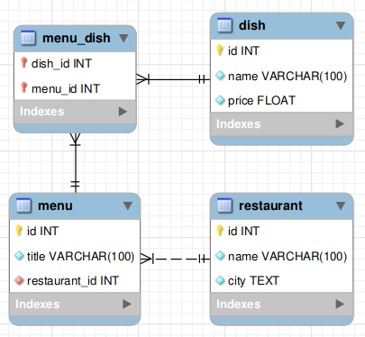

# SQL Queries

Import the [restaurant.sql](./restaurant.sql) file into MySQL.

Create the following queries :

1. Select all restaurant's name
    -> select * from restaurant;

2. Select all menu's title alphabetically
    -> select title from menu ORDER BY title;

3. Select each dish's name and price, in decreasing price order
    -> select name, price from dish ORDER BY dish.price DESC;

4. Select restaurant's name located in the city of Paris
    -> select name from restaurant WHERE city = "Paris";

5. Select all menu's title which contains the word "menu"
    -> select * FROM menu WHERE title LIKE "%menu%";

6. Select cities without duplicates
    -> select DISTINCT city FROM restaurant;

7. Select the name of the most expensive dish
    -> select name, price FROM dish ORDER BY price DESC LIMIT 0,1;

8. Select all menu's title and the restaurant's name where they are sold
    -> select m.title, r.name from menu as m join restaurant as r on r.id = m.restaurant_id;

9. Select all dish's name (without duplicate) which are contained by at least one menu
    -> select DISTINCT d.name from dish as d inner join menu as m on d.id = m.id;

10. Select all dish's name and price with corresponding menu's title
    -> select d.name, d.price, m.title FROM dish as d join menu_dish as md on d.id = md.dish_id join menu as m on m.id = md.menu_id;

11. Select each dish's name and price, corresponding menu's title and restaurant's name who sells it
    -> select d.name, d.price, m.title, r.name FROM dish as d join menu_dish as md on d.id = md.dish_id join menu as m on m.id = md.menu_id join restaurant as r on r.id = m.restaurant_id;

12. Select all the restaurants' name which don't sell any menu
    -> select r.name FROM restaurant as r left join menu as m on r.id = restaurant_id WHERE m.title IS NULL;

13. Select all dish's name not contained in any menu
    -> select d.name FROM dish as d left join menu_dish as md on d.id = md.dish_id WHERE md.dish_id IS NULL;

14. Select each city's name and how many restaurants located in this city

15. Select menu's title and dishes' count for each menu

16. Select the title of the menu with the most dishes

17. Select, for each restaurant, its name and how many menus it sells (some restaurants might not have any menu)

18. Select all menu's title and dishes count, where menus have more than two dishes.

19. Select all restaurant's name which sells at least one menu where dishes' price combined is 30 or more

## Hints :

    
Request 1

    
Request 2

    ORDER BY

    
Request 3

    ORDER BY

    
Request 4

    WHERE

    
Request 5

    LIKE

    
Request 6

    DISTINCT

    
Request 7

    ORDER BY, LIMIT

    
Request 8

    INNER JOIN

    
Request 9

    DISTINCT, INNER JOIN

    
Request 10

    INNER JOIN (x2)

    
Request 11

    INNER JOIN (x3)

    
Request 12

    LEFT JOIN

    
Request 13

    LEFT JOIN

    
Request 14

    COUNT, GROUP BY

    
Request 15

    COUNT, INNER JOIN (x2), GROUP BY

    
Request 16

    CCOUNT, INNER JOIN (x2), GROUP BY, ORDER BY, LIMIT

    
Request 17

    COUNT, LEFT JOIN, GROUP BY

    
Request 18

    COUNT, INNER JOIN, GROUP BY, HAVING

    
Request 19

    DISTINCT, INNER JOIN (x3), GROUP BY, HAVING

